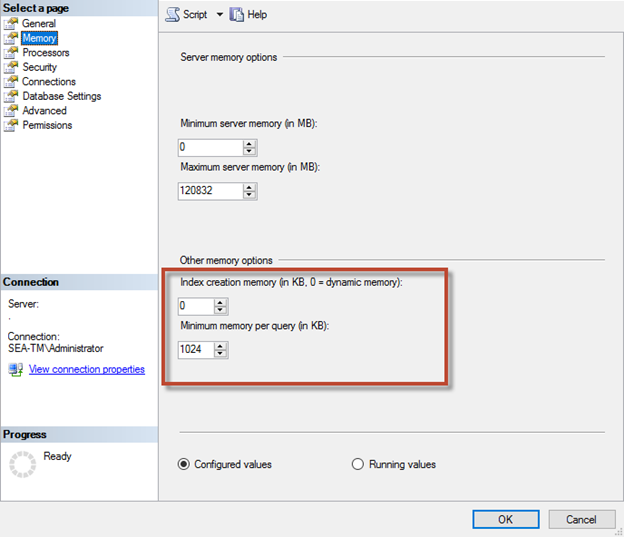

= Memory configuration
[.lead]

== Max server memory

The max server memory option sets the maximum amount of memory that the SQL Server instance can use.

It is generally used if multiple applications are running on the same server where SQL Server is running and you want to guarantee that these applications have sufficient memory to function properly.

Some applications only use whatever memory is available when they start and do not request more even if needed. That is where the max server memory setting comes into play.

On a SQL Server cluster with several SQL Server instances, each instance could be competing for resources. Setting a memory limit for each SQL Server instance can help guarantee best performance for each instance.

NetApp recommends leaving at least 4GB to 6GB of RAM for the operating system to avoid performance issues. 

image:./media/max-server-memory.png[Error: Missing Graphic Image]

=== Adjusting minimum and maximum server memory using SQL Server Management Studio.

Using SQL Server Management Studio to adjust minimum or maximum server memory requires a restart of the SQL Server service. You can adjust server memory using transact SQL (T-SQL) using this code:

....
EXECUTE sp_configure 'show advanced options', 1

GO

EXECUTE sp_configure 'min server memory (MB)', 2048

GO

EXEC sp_configure 'max server memory (MB)', 120832

GO

RECONFIGURE WITH OVERRIDE
....

== Nonuniform memory access

Nonuniform memory access (NUMA) is a memory-access optimization method that helps increase processor speed without increasing the load on the processor bus. 

If NUMA is configured on the server where SQL Server is installed, no additional configuration is required because SQL Server is NUMA aware and performs well on NUMA hardware.

== Index create memory

The index create memory option is another advanced option that you should not usually change.

It controls the maximum amount of RAM initially allocated for creating indexes. The default value for this option is 0, which means that it is managed by SQL Server automatically. However, if you encounter difficulties creating indexes, consider increasing the value of this option.

== Min memory per query

When a query is run, SQL Server tries to allocate the optimum amount of memory for it to run efficiently.

By default, the min memory per query setting allocates > or = to 1024KB for each query to run. It is a best practice is to leave this setting at the default value of 0 to allow SQL Server to dynamically manage the amount of memory allocated for index creation operations. However, if SQL Server has more RAM than it needs to run efficiently, the performance of some queries can be boosted if you increase this setting. Therefore, as long as memory is available on the server that is not being used by SQL Server, any other applications, or the operating system, then boosting this setting can help overall SQL Server performance. If no free memory is available, increasing this setting might hurt overall performance.

== Buffer pool extensions

The buffer pool extension provides seamless integration of an NVRAM extension with the database engine buffer pool to significantly improve I/O throughput. 

The buffer pool extension is not available in every SQL Server edition. It is available only with the 64-bit SQL Server Standard, Business Intelligence, and Enterprise editions.

The buffer pool extension feature extends the buffer pool cache with nonvolatile storage (usually SSDs). The extension allows the buffer pool to accommodate a larger database working set, forcing the paging of I/O between the RAM and the SSDs and effectively offloading small random I/Os from mechanical disks to SSDs. Because of the lower latency and better random I/O performance of SSDs, the buffer pool extension significantly improves I/O throughput.

The buffer pool extension feature offers the following benefits:

* Increased random I/O throughput
* Reduced I/O latency
* Increased transaction throughput
* Improved read performance with a larger hybrid buffer pool
* A caching architecture that can take advantage of existing and future low-cost memory

For buffer pool extensions, NetApp recommends the following:

* Make sure that an SSD-backed LUN (such as NetApp AFF) is presented to the SQL Server host so that it can be used as a buffer pool extension target disk.

* The extension file must be the same size as or larger than the buffer pool.

The following example shows a T-SQL command to set up a buffer pool extension of 32GB.

....
USE master

GO

ALTER SERVER CONFIGURATION

SET BUFFER POOL EXTENSION ON

  (FILENAME = ‘P:\BUFFER POOL EXTENSION\SQLServerCache.BUFFER POOL EXTENSION’, SIZE = 32 GB);

GO
....