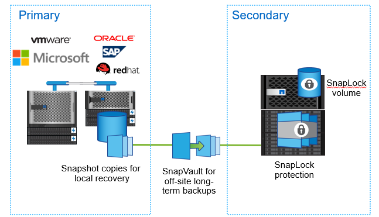

= Database security
:imagesdir: ../media/

[.lead]
Securing database is always been priority and DBA and organization enforce hardening checkpoints to allow only authorize user to have access to server and database. From regular patching of server, configuring firewall, removal of generic guest or public access, and granting minimal permission to limited user to run applications or run adhoc reporting queries are all part of securing business ecosystem. 

As cases of ransomware or internal threats have increased, business data and backups need to be protected and should be able to recover quickly in consistent order from malicious attacks. Attackers might still find ways to hijack data.
ONTAP offers a variety of capabilities to secure data on NAS and SAN.

ONTAP allows backing up flexible volumes to a SnapLock Enterprise or a SnapLock Compliance volume by creating SnapMirror relationship between FlexVol volume as source and SnapLock volume as destination.Snapshot copies backed up to secondary storage are protected against modification or deletion until its retention date using SnapLock technology.This is based on SnapMirror policy associated with relationship where the number of Snapshot copies are defined for a particular snapmirror-label retained on the destination SnapLock volume.To restore snapshot that contains LUN data can be done on non-SnapLock volume through snapmirror restore operation. In ONTAP 9.13.1, FlexClone copy can be created by specifying SnapLock type as non-snaplock. For more information on SnapLock, see link:https://docs.netapp.com/us-en/ontap/snaplock/[here].

Tamperproof Snapshot copies or snapshot copy locking : Snapshot copy is quick way to protect and restore database. An attacker might delete Snapshot copies which could have been the last option to restore a database in case of data corruption. Enabling tamperproof Snapshot copies locks the Snapshot copy on primary or secondary ONTAP system to prevent rougue administrator or untrusted administrator from deleting snapshots for a specified period. The tamperproof Snapshot copy feature is available from ONTAP 9.12.1 and requires the SnapLock license and initialization of compliance clock.

ONTAP has a multi-admin verification (MAV) feature which means no single administrator has a complete privilege to delete Snapshot copies or modify volumes. This can act as additional security to avoid volumes or Snapshot copies getting tampered again by untrusted administrators.