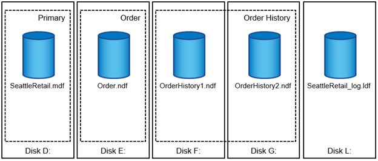

= Database files and filegroups

[.lead]
A SQL Server database is a collection of objects that allows you to store and manipulate data. 

In theory, SQL Server (64-bit) supports 32,767 databases per instance and 524,272TB of database size, although the typical installation usually has several databases. However, the number of the databases SQL Server can handle depends on the load and hardware. It is not unusual to see SQL Server instances hosting dozens, hundreds, or even thousands of small databases.

Each database consists of one or more data files and one or more transaction log files. The transaction log stores the information about database transactions and all data modifications made by each session. Every time the data is modified, SQL Server stores enough information in the transaction log to undo (roll back) or redo (replay) the action. A SQL Server transaction log is an integral part of SQL Server’s reputation for data integrity and robustness. The transaction log is vital to the atomicity, consistency, isolation, and durability (ACID) capabilities of SQL Server. SQL Server writes to the transaction log as soon as any change to the data page happens. Every Data Manipulation Language (DML) statement (for example, select, insert, update, or delete) is a complete transaction, and the transaction log makes sure that the entire set-based operation takes place, making sure of the atomicity of the transaction.

Each database has one primary data file, which, by default, has the .mdf extension. In addition, each database can have secondary database files. Those files, by default, have .ndf extensions.

All database files are grouped into filegroups. A filegroup is the logical unit, which simplifies database administration. They allow the separation between logical object placement and physical database files. When you create the database objects tables, you specify in what filegroup they should be placed without worrying about the underlying data file configuration.

The ability to put multiple data files inside the filegroup enables you to spread the load across different storage devices, which helps to improve the I/O performance of the system. The transaction log in contrast does not benefit from the multiple files because SQL Server writes to the transaction log in a sequential manner.

The separation between logical object placement in the filegroups and physical database files allows you to fine-tune the database file layout, getting the most from the storage subsystem. For example, independent software vendors (ISVs) who are deploying their products to different customers can adjust the number of database files based on the underlying I/O configuration and the expected amount of data during the deployment stage. Those changes are transparent to the application developers, who are placing the database objects in the filegroups rather than database files.

NetApp recommends avoiding the use of the primary filegroup for anything but system objects. Creating a separate filegroup or set of filegroups for the user objects simplifies database administration and disaster recovery, especially in the case of large databases.

You can specify initial file size and autogrowth parameters at the time when you create the database or add new files to an existing database. SQL Server uses a proportional fill algorithm when choosing which data file it should write data into. It writes an amount of data proportionally to the free space available in the files. The more free space in the file, the more writes it handles.

NetApp recommends that all files in the single filegroup have the same initial size and autogrowth parameters, with the grow size defined in megabytes rather than percentages. This helps the proportional fill algorithm evenly balance write activities across data files.

Every time SQL Server grows the files, it fills newly allocated space in the files with zeros. That process blocks all sessions that need to write to the corresponding file or, in case of transaction log growth, generate transaction log records.

SQL Server always zeroes out the transaction log, and that behavior cannot be changed. However, you can control whether data files are zeroing out by enabling or disabling instant file initialization. Enabling instant file initialization helps to speed up data file growth and reduces the time required to create or restore the database.

A small security risk is associated with instant file initialization. When this option is enabled, unallocated parts of the data file can contain information from previously deleted OS files. Database administrators can examine such data.

You can enable instant file initialization by adding the SA_MANAGE_VOLUME_NAME permission, also known as “perform volume maintenance task,” to the SQL Server startup account. You can do this under the local security policy management application (secpol.msc), as shown in the following figure. Open the properties for the “perform volume maintenance task” permission and add the SQL Server startup account to the list of users there. 

image:./media/security-policy.png[]

To check if the permission is enabled, you can use the code from the following example. This code sets two trace flags that force SQL Server to write additional information to the error log, create a small database, and read the content of the log.

`DBCC TRACEON(3004,3605,-1)

GO

CREATE DATABASE DelMe

GO

EXECUTE sp_readerrorlog

GO

DROP DATABASE DelMe

GO

DBCC TRACEOFF(3004,3605,-1)

GO`

When instant file initialization is not enabled, the SQL Server error log shows that SQL Server is zeroing the mdf data file in addition to zeroing the ldf log file, as shown in the following example. When instant file initialization is enabled, it displays only zeroing of the log file.

image:./media/zeroing.png[]

The perform volume maintenance task is simplified in SQL Server 2016 and is later provided as an option during the installation process. Figure 6 displays the option to grant the SQL Server database engine service the privilege to perform the volume maintenance task.

image:./media/maintenance.png[]

Another important database option that controls the database file sizes is autoshrink. When this option is enabled, SQL Server regularly shrinks the database files, reduces their size, and releases space to the operating system. This operation is resource intensive and is rarely useful because the database files grow again after some time when new data comes into the system. Autoshrink must never be enabled on the database.
