= vMSC Design and Implementation Guidelines 
:hardbreaks:
:nofooter:
:icons: font
:linkattrs:
:imagesdir: ../media/

[.lead]
This document outlines the design and implementation guidlines for vMSC with ONTAP storage systems.

== NetApp Storage Configuration

Setup instructions for NetApp MetroCluster (referred to as an MCC configuration) are available at https://docs.netapp.com/us-en/ontap-metrocluster/[MetroCluster Documentation]. Instructions for SnapMirror active sync are also available at https://docs.netapp.com/us-en/ontap/smbc/index.html[SnapMirror Business Continuity overview].

Once you have configured MetroCluster, administering it is like managing a traditional ONTAP environment. You can set up Storage Virtual Machines (SVMs) using various tools like the Command Line Interface (CLI), System Manager, or Ansible. Once the SVMs are configured, create Logical Interfaces (LIFs), volumes, and Logical Unit Numbers (LUNs) on the cluster that will be used for normal operations. These objects will automatically be replicated to the other cluster using the cluster peering network.

If not using MetroCluster, you can use SnapMirror active sync which provides datastore-granular protection and active-active access across multiple ONTAP clusters in different failure domains. SnapMirror active sync uses consistency groups to ensure write-order consistency among one or more datastores and you can create multiple consistency groups depending on your application and datastore requirements. Consistency groups are especially useful for applications that require data synchronization between multiple datastores. SnapMirror active sync also supports Raw Device Mappings (RDMs) and guest-connected storage with in-guest iSCSI initiators. You can learn more about consistency groups at https://docs.netapp.com/us-en/ontap/consistency-groups/index.html[Consistency groups overview].

There is some difference in managing a vMSC configuration with SnapMirror active sync when compared to a MetroCluster. First, this is a SAN-only configuration, no NFS datastores can be protected with SnapMirror active sync. Second, you must map both copies of the LUNs to your ESXi hosts for them to access the replicated datastores in both failure domains.

== VMware vSphere HA

=== Create a vSphere HA Cluster

Creating a vSphere HA cluster is a multi-step process that is fully documented at https://docs.vmware.com/en/VMware-vSphere/8.0/vsphere-vcenter-esxi-management/GUID-F7818000-26E3-4E2A-93D2-FCDCE7114508.html[How Do You Create and Configure Clusters in the vSphere Client on docs.vmware.com]. In short, you must first create an empty cluster, and then, using vCenter, you must add hosts and specify the cluster’s vSphere HA and other settings.

*Note:* Nothing in this document supersedes https://core.vmware.com/resource/vmware-vsphere-metro-storage-cluster-recommended-practices[VMware vSphere Metro Storage Cluster Recommended Practices]

To configure an HA cluster, complete the following steps:

[arabic]
. Connect to the vCenter UI.
. In Hosts and Clusters, browse to the data center where you want to create your HA cluster.
. Right-click the data center object and select New Cluster. Under basics ensure you have enabled vSphere DRS and vSphere HA. Complete the wizard.

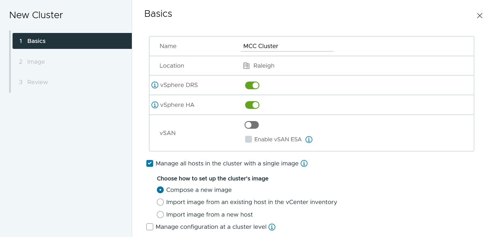
[start=4]
. Select the cluster and go to the configure tab. Select vSphere HA and click edit.
. Under Host Monitoring, select the Enable Host Monitoring option.

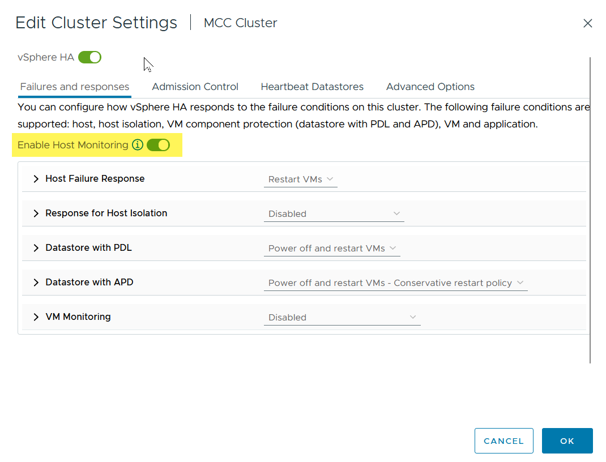
[start=6]
. While still on the Failures and Responses tab, Under VM Monitoring, select the VM Monitoring Only option or VM and Application Monitoring option.

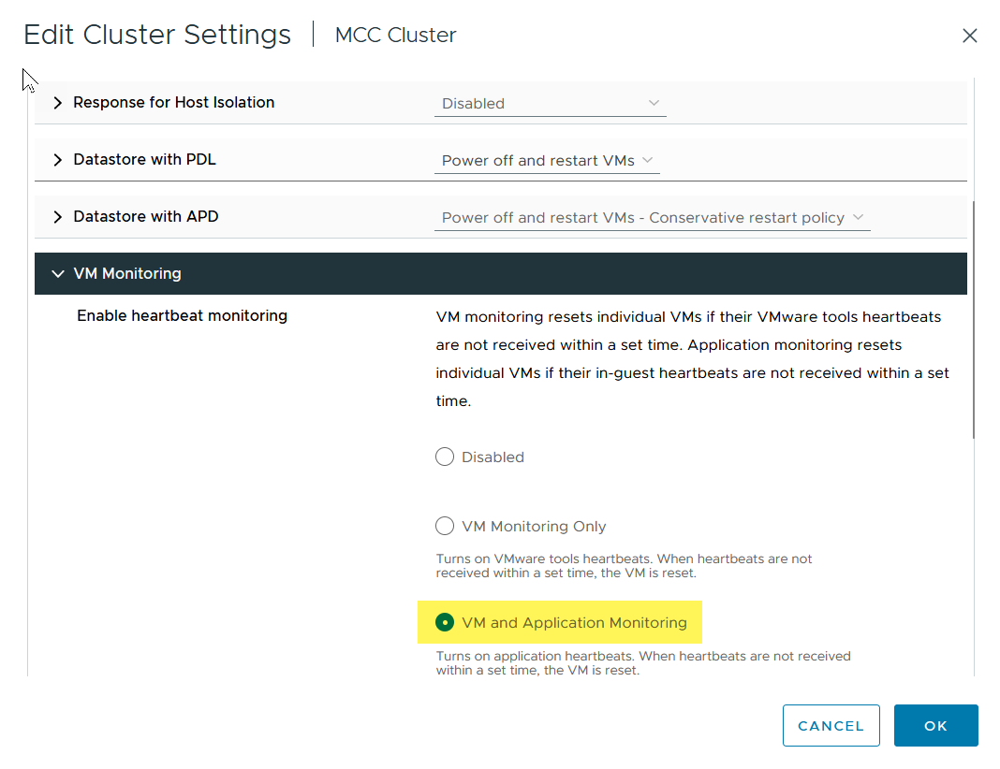
[start=7]
. Under Admission Control, set the HA admission control option to cluster resource reserve; use 50% CPU/MEM.

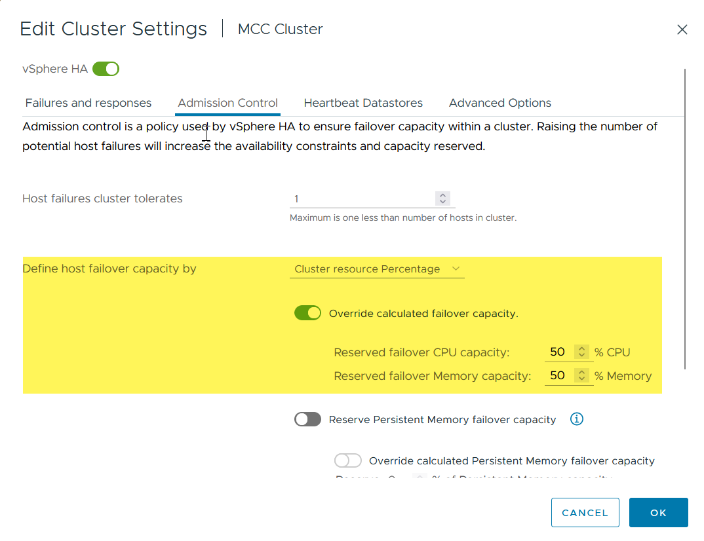
[start=8]
. Click “OK”.
. Select DRS and click EDIT.
. Set the automation level to manual unless required by your applications.

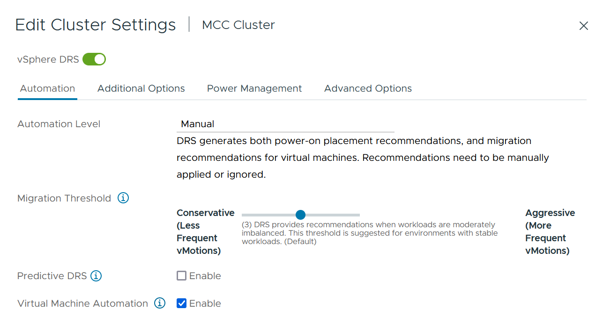
[start=11]
. Enable VM Component Protection, refer to https://docs.vmware.com/en/VMware-vSphere/8.0/vsphere-availability/GUID-F01F7EB8-FF9D-45E2-A093-5F56A788D027.html[docs.vmware.com].
. The following additional vSphere HA settings are recommended for vMSC with MCC:

[width="100%",cols="50%,50%",options="header",]
|===
|Failure |Response
|Host failure |Restart VMs
|Host isolation |Disabled
|Datastore with Permanent Device Loss (PDL) |Power off and restart VMs
|Datastore with All paths Down (APD) |Power off and restart VMs
|Guest not heartbeating |Reset VMs
|VM restart policy |Determined by the importance of the VM
|Response for host isolation |Shut down and restart VMs
|Response for datastore with PDL |Power off and restart VMs
|Response for datastore with APD |Power off and restart VMs (conservative)
|Delay for VM failover for APD |3 minutes
|Response for APD recovery with APD timeout |Disabled
|VM monitoring sensitivity |Preset high
|===

=== Configure Datastores for Heartbeating

vSphere HA uses datastores to monitor hosts and virtual machines when the management network has failed. You can configure how vCenter selects heartbeat datastores. To configure datastores for heartbeating, complete the following steps:

[arabic]
. In the Datastore Heartbeating section, select Use Datastores from the Specified List and Compliment Automatically if Needed.
. Select the datastores you want vCenter to use from both sites and press OK.

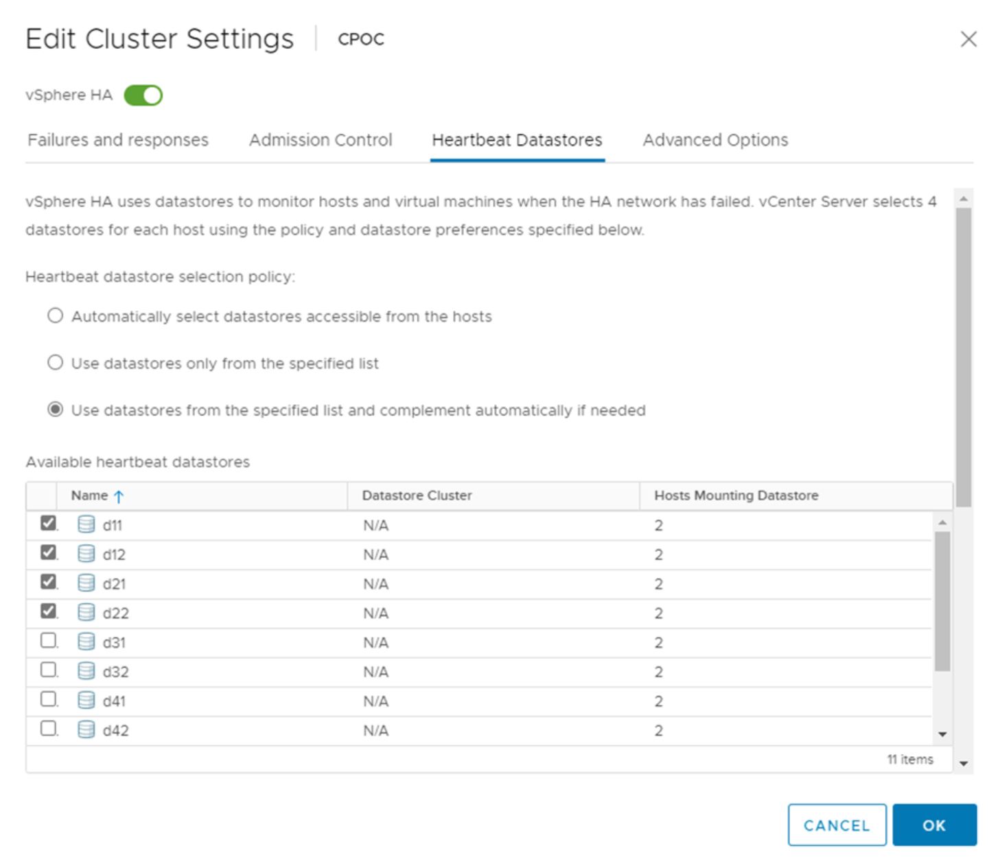

=== Configure Advanced Options

*Host Failure Detection*

Isolation events occur when hosts within an HA cluster lose connectivity to either the network or other hosts in the cluster. By default, vSphere HA will use the default gateway for its management network as the default isolation address. However, you can specify additional isolation addresses for the host to ping to determine whether an isolation response should be triggered. Add two isolation IPs that can ping, one per site. Do not use the gateway IP. The vSphere HA advanced setting used is das.isolationaddress. You can use ONTAP or Mediator IP addresses for this purpose.

Refer to https://core.vmware.com/resource/vmware-vsphere-metro-storage-cluster-recommended-practices#sec2-sub5[core.vmware.com] for more information__.__

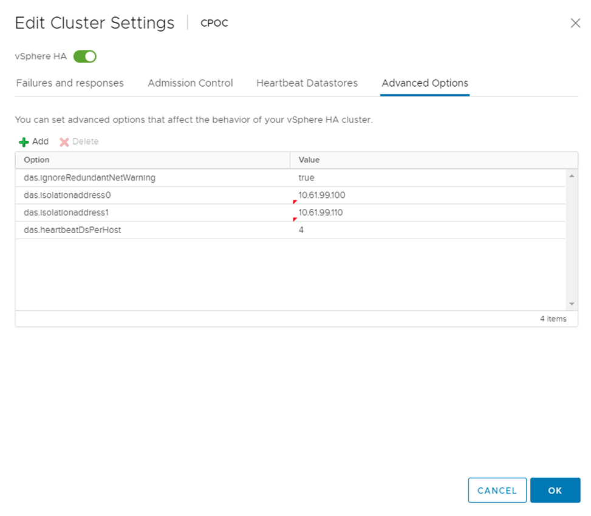

Adding an advanced setting called das.heartbeatDsPerHost can increase the number of heartbeat datastores. Use four heartbeat datastores (HB DSs)—two per site. Use the “Select from List but Compliment” option. This is needed because if one site fails, you still need two HB DSs. However, those don’t have to be protected with MCC or SnapMirror active sync.

Refer to https://core.vmware.com/resource/vmware-vsphere-metro-storage-cluster-recommended-practices#sec2-sub5[core.vmware.com] for more information__.__

VMware DRS Affinity for NetApp MetroCluster

In this section, we create DRS groups for VMs and hosts for each site\cluster in the MetroCluster environment. Then we configure VM\Host rules to align VM host affinity with local storage resources. For example, site A VMs belong to VM group sitea_vms and site A hosts belong to host group sitea_hosts. Next, in VM\Host Rules, we state that sitea_vms should run on hosts in sitea_hosts.

=== _Best Practice_
* NetApp highly recommends the specification *Should Run on Hosts in Group* rather than the specification *Must Run on Hosts in Group*. In the event of a site A host failure, the VMs of site A need to be restarted on hosts at site B through vSphere HA, but the latter specification does not allow HA to restart VMs on site B because it’s a hard rule. The former specification is a soft rule and will be violated in the event of HA, thus enabling availability rather than performance.

*Note:* You can create an event-based alarm that is triggered when a virtual machine violates a VM-Host affinity rule. In the vSphere Client, add a new alarm for the virtual machine and select “VM is violating VM-Host Affinity Rule” as the event trigger. For more information about creating and editing alarms, refer to http://pubs.vmware.com/vsphere-51/topic/com.vmware.ICbase/PDF/vsphere-esxi-vcenter-server-51-monitoring-performance-guide.pdf[vSphere Monitoring and Performance] documentation.

=== Create DRS Host Groups

To create DRS host groups specific to site A and site B, complete the following steps:

[arabic]
. In the vSphere web client, right-click the cluster in the inventory and select Settings.
. Click VM\Host Groups.
. Click Add.
. Type the name for the group (for instance, sitea_hosts).
. From the Type menu, select Host Group.
. Click Add and select the desired hosts from site A and click OK.
. Repeat these steps to add another host group for site B.
. Click OK.

=== Create DRS VM Groups

To create DRS VM groups specific to site A and site B, complete the following steps:

[arabic]
. In the vSphere web client, right-click the cluster in the inventory and select Settings.

[arabic, start=9]
. Click VM\Host Groups.
. Click Add.
. Type the name for the group (for instance, sitea_vms).
. From the Type menu, select VM Group.
. Click Add and select the desired VMs from site A and click OK.
. Repeat these steps to add another host group for site B.
. Click OK.

=== Create VM Host Rules

To create DRS affinity rules specific to site A and site B, complete the following steps:

[arabic]
. In the vSphere web client, right-click the cluster in the inventory and select Settings.

[arabic]
. Click VM\Host Rules.
. Click Add.
. Type the name for the rule (for instance, sitea_affinity).
. Verify the Enable Rule option is checked.
. From the Type menu, select Virtual Machines to Hosts.
. Select the VM group (for instance, sitea_vms).
. Select the Host group (for instance, sitea_hosts).
. Repeat these steps to add another VM\Host Rule for site B.
. Click OK.

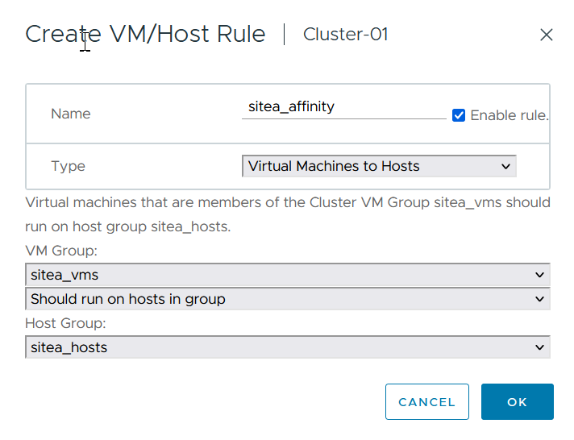

== VMWare vSphere Storage DRS for NetApp MetroCluster

=== Create Datastore Clusters

To configure a datastore cluster for each site, complete the following steps:

[arabic]
. Using the vSphere web client, browse to the data center where the HA cluster resides under Storage.
. Right-click the data center object and select Storage > New Datastore Cluster.
. Select the Turn ON Storage DRS option and click Next.
. Set all options to No Automation (Manual Mode) and click Next.

==== _Best Practice_
* NetApp recommends that Storage DRS be configured in manual mode, so that the administrator gets to decide and control when migrations need to happen.

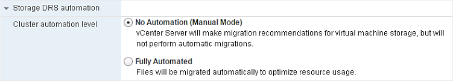

[arabic, start=5]
. Verify that the Enable I/O Metric for SDRS Recommendations checkbox is checked; metric settings can be left with default values.

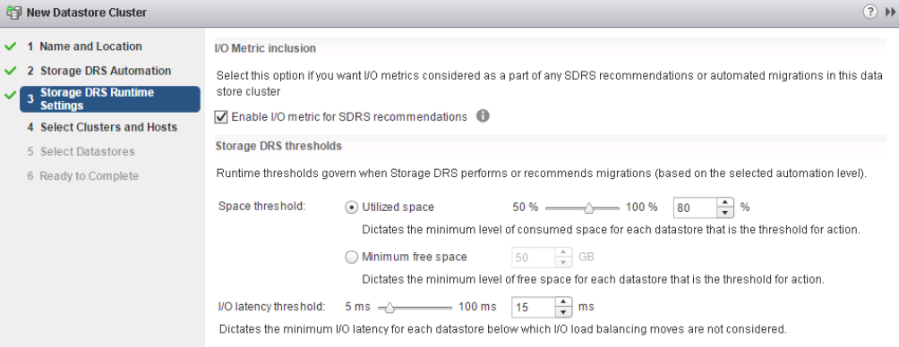

[arabic, start=6]
. Select the HA cluster and click Next.

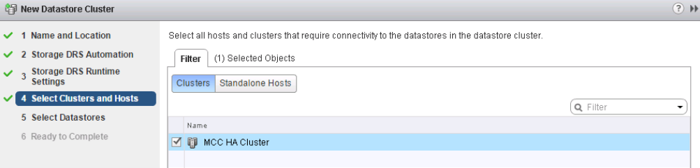

[arabic, start=7]
. Select the datastores belonging to site A and click Next.

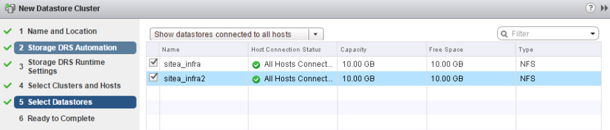

[arabic, start=8]
. Review options and click Finish.
. Repeat these steps to create the site B datastore cluster and verify that only datastores of site B are selected.

=== vCenter Server Availability

Your vCenter Server Appliances (VCSAs) should be protected with vCenter HA. vCenter HA allows you to deploy two VCSAs in an active-passive HA pair. One in each failure domain. You can read more about vCenter HA on https://docs.vmware.com/en/VMware-vSphere/8.0/vsphere-availability/GUID-4A626993-A829-495C-9659-F64BA8B560BD.html[docs.vmware.com].
