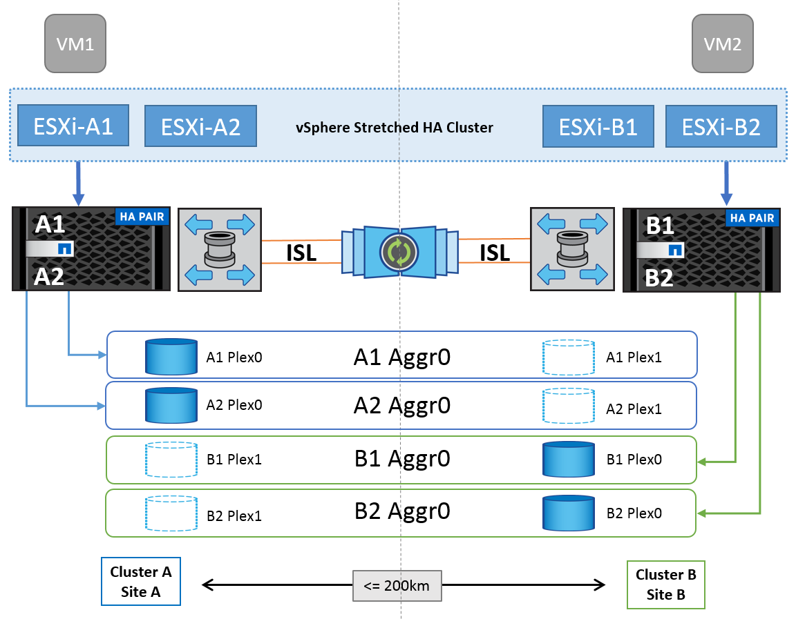
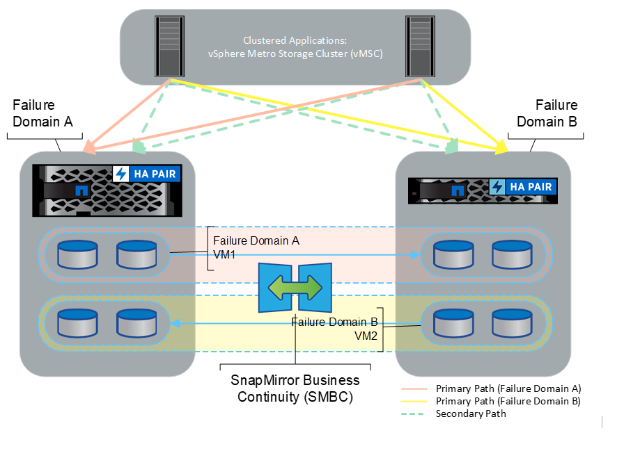

= vSphere Metro Storage Cluster with NetApp ONTAP
:hardbreaks:
:nofooter:
:icons: font
:linkattrs:
:imagesdir: ../media/

[.lead]
VMware’s industry-leading vSphere hypervisor can be deployed as a stretched cluster referred to as a vSphere Metro Storage Cluster (vMSC). 

vMSC solutions are supported with both NetApp® MetroCluster™ and SnapMirror active sync (formerly known as SnapMirror Business Continuity, or SMBC) and provide advanced business continuity if one or more failure domains suffer a total outage. The resilience to different modes of failure depends on which configuration options you choose.

== Continuous Availability Solutions for vSphere Environments

The NetApp ONTAP architecture is a flexible and scalable storage platform that provides SAN (FCP, iSCSI, and NVMe-oF) and NAS (NFS v3 and v4.1) services for datastores. The NetApp AFF, ASA, and FAS storage systems use the ONTAP operating system to offer additional protocols for guest storage access like S3 and SMB/CIFS.

NetApp MetroCluster uses NetApp's HA (controller failover or CFO) function to protect against controller failures. It also includes local SyncMirror technology, cluster failover on disaster (controller failover on demand or CFOD), hardware redundancy, and geographical separation to achieve high levels of availability. SyncMirror synchronously mirrors data across the two halves of the MetroCluster configuration by writing data to two plexes: the local plex (on the local shelf) actively serving data and the remote plex (on the remote shelf) normally not serving data. Hardware redundancy is put in place for all MetroCluster components such as controllers, storage, cables, switches (used with fabric MetroCluster), and adapters.

NetApp SnapMirror active sync provides datastore-granular protection with FCP and iSCSI SAN protocols, allowing you to selectively protect only high-priority workloads. It offers active-active access to both local and remote sites, unlike NetApp MetroCluster which is an active-standby solution. At present, active sync is an asymmetric solution where one side is preferred over the other, providing better performance. This is achieved using ALUA (Asymmetric Logical Unit Access) functionality which automatically informs the ESXi host which controllers to prefer. However, NetApp has announced that active sync will soon enable fully symmetric access.

To create a VMware HA/DRS cluster across two sites, ESXi hosts are used and managed by a vCenter Server Appliance (VCSA). The vSphere management, vMotion®, and virtual machine networks are connected through a redundant network between the two sites. The vCenter Server managing the HA/DRS cluster can connect to the ESXi hosts at both sites and should be configured using vCenter HA.

Refer to https://docs.vmware.com/en/VMware-vSphere/8.0/vsphere-vcenter-esxi-management/GUID-F7818000-26E3-4E2A-93D2-FCDCE7114508.html[How Do You Create and Configure Clusters in the vSphere Client] to configure vCenter HA.

You should also refer to https://core.vmware.com/resource/vmware-vsphere-metro-storage-cluster-recommended-practices[VMware vSphere Metro Storage Cluster Recommended Practices].

== What is vSphere Metro Storage Cluster?

vSphere Metro Storage Cluster (vMSC) is a certified configuration that protects virtual machines (VMs) and containers against failures. This is achieved by using stretched storage concepts along with clusters of ESXi hosts, which are distributed across different failure domains such as racks, buildings, campuses, or even cities. The NetApp MetroCluster and SnapMirror active sync storage technologies are used to provide RPO=0 or near RPO=0 protection respectively to the host clusters. The vMSC configuration is designed to ensure that data is always available even if a complete physical or logical “site” fails. A storage device that is part of the vMSC configuration must be certified after undergoing a successful vMSC certification process. All the supported storage devices can be found in the https://www.vmware.com/resources/compatibility/search.php[VMware Storage Compatibility Guide]. 

If you want more information about the design guidelines for vSphere Metro Storage Cluster, you can refer to the following documentation: 

* https://kb.vmware.com/s/article/2031038[VMware vSphere support with NetApp MetroCluster]

* https://kb.vmware.com/s/article/83370[VMware vSphere support with NetApp SnapMirror Business Continuity] (now known as SnapMirror active sync)

Depending on the latency considerations, NetApp MetroCluster can be deployed in two different configurations for use with vSphere: 

* Stretch MetroCluster

* Fabric MetroCluster

The following illustrates a high-level topology diagram of stretch MetroCluster.

Refer to https://www.netapp.com/support-and-training/documentation/metrocluster/[MetroCluster documentation] for specific design and deployment information for MetroCluster.

SnapMirror active sync can also be deployed in two different ways.

* Asymmetric
* Symmetric (private preview in ONTAP 9.14.1)

Refer to https://docs.netapp.com/us-en/ontap/smbc/index.html[NetApp Docs] for specific design and deployment information for SnapMirror active sync.
