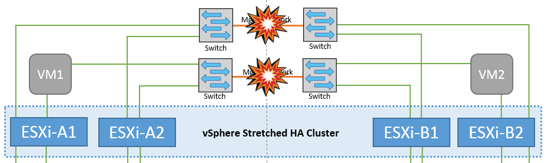
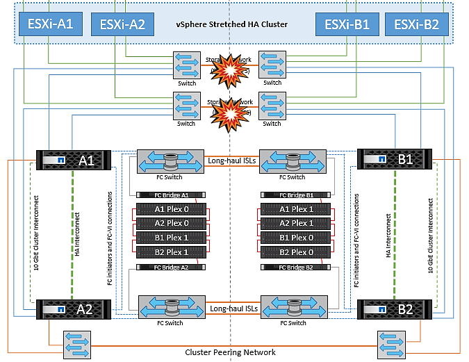
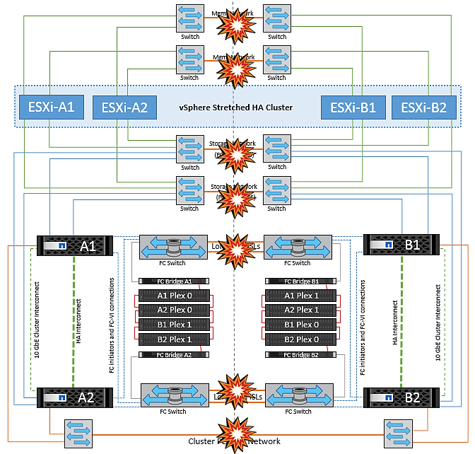

= Failure Scenarios for vMSC with MCC
:hardbreaks:
:nofooter:
:icons: font
:linkattrs:
:imagesdir: ../media/

[.lead]
The following sections outline the expected results from various failure scenarios with vMSC and NetApp MetroCluster systems.

== Single Storage Path Failure

In this scenario, if components such as the HBA port, the network port, the front-end data switch port, or an FC or Ethernet cable fails, that particular path to the storage device is marked as dead by the ESXi host. If several paths are configured for the storage device by providing resiliency at the HBA/network/switch port, ESXi ideally performs a path switchover. During this period, virtual machines remain running without getting affected, because availability to the storage is taken care of by providing multiple paths to the storage device.

*Note:* There is no change in MetroCluster behavior in this scenario, and all the datastores continue to be intact from their respective sites.

=== _Best Practice_
In environments in which NFS/iSCSI volumes are used, NetApp recommends having at least two network uplinks configured for the NFS vmkernel port in the standard vSwitch and the same at the port group where the NFS vmkernel interface is mapped for the distributed vSwitch. NIC teaming can be configured in either active-active or active-standby.

Also, for iSCSI LUNs, multipathing must be configured by binding the vmkernel interfaces to the iSCSI network adapters. For more information, refer to the vSphere storage documentation.

=== _Best Practice_
In environments in which Fibre Channel LUNs are used, NetApp recommends having at least two HBAs, which guarantees resiliency at the HBA/port level. NetApp also recommends single initiator to single target zoning as the best practice to configure zoning.

Virtual Storage Console (VSC) should be used to set multipathing policies because it sets policies for all new and existing NetApp storage devices.

== Single ESXi Host Failure

image::../media/vmsc_5_1.png[A single host failure.,width=624,height=598]

In this scenario, if there is an ESXi host failure, the master node in the VMware HA cluster detects the host failure since it no longer receives network heartbeats. To determine whether the host is really down or only a network partition, the master node monitors the datastore heartbeats and, if they are absent, it performs a final check by pinging the management IP addresses of the failed host. If all these checks are negative, then the master node declares this host a failed host and all the virtual machines that were running on this failed host are rebooted on the surviving host in the cluster.

If DRS VM and host affinity rules have been configured (VMs in VM group sitea_vms should run hosts in host group sitea_hosts), then the HA master first checks for available resources at site A. If there are no available hosts at site A, the master attempts to restart the VMs on hosts at site B.

It is possible that the virtual machines will be started on the ESXi hosts at the other site if there is a resource constraint in the local site. However, the defined DRS VM and host affinity rules will correct if any rules are violated by migrating the virtual machines back to any surviving ESXi hosts in the local site. In cases in which DRS is set to manual, NetApp recommends invoking DRS and applying the recommendations to correct the virtual machine placement.

There is no change in the MetroCluster behavior in this scenario and all the datastores continue to be intact from their respective sites.

== ESXi Host Isolation

In this scenario, if the management network of the ESXi host is down, the master node in the HA cluster will not receive any heartbeats, and thus this host becomes isolated in the network. To determine whether it has failed or is only isolated, the master node starts monitoring the datastore heartbeat. If it is present then the host is declared isolated by the master node. Depending on the isolation response configured, the host may choose to power off, shut down the virtual machines, or even leave the virtual machines powered on. The default interval for the isolation response is 30 seconds.

There is no change in the MetroCluster behavior in this scenario and all the datastores continue to be intact from their respective sites.

== Disk Shelf Failure

In this scenario, there is a failure of more than two disks or an entire shelf. Data is served from the surviving plex with no interruption to data services. The disk failure could affect either a local or remote plex. The aggregates will show as degraded mode because only one plex is active. Once the failed disks are replaced, the affected aggregates will automatically resync to rebuild the data. After resync, the aggregates will return automatically to normal mirrored mode. If more than two disks within a single RAID group have failed, then the plex has to be rebuilt from scratch.

image::../media/vmsc_5_3.png[A single disk shelf failure.,width=624,height=576]

*Note:* During this period, there is no impact on the virtual machine I/O operations, but there is degraded performance because the data is being accessed from the remote disk shelf through ISL links.

== Single Storage Controller Failure

In this scenario, one of the two storage controllers fails at one site. Because there is an HA pair at each site, a failure of one node transparently and automatically triggers failover to the other node. For example, if node A1 fails, its storage and workloads are automatically transferred to node A2. Virtual machines will not be affected because all plexes remain available. The second site nodes (B1 and B2) are unaffected. In addition, vSphere HA will not take any action because the master node in the cluster will still be receiving the network heartbeats.

image::../media/vmsc_5_4.png[A single node failure,width=624,height=603]

If the failover is part of a rolling disaster (node A1 fails over to A2), and there is a subsequent failure of A2, or the complete failure of site A, switchover following a disaster can occur at site B.

== Interswitch Link Failures

=== Interswitch Link Failure at Management Network

In this scenario, if the ISL links at the front-end host management network fail, the ESXi hosts at site A will not be able to communicate with ESXi hosts at site B. This will lead to a network partition because ESXi hosts at a particular site will be unable to send the network heartbeats to the master node in the HA cluster. As such, there will be two network segments because of partition and there will be a master node in each segment that will protect VMs from host failures within the particular site.

*Note:* During this period, the virtual machines remain running and there is no change in the MetroCluster behavior in this scenario. All the datastores continue to be intact from their respective sites.

=== Interswitch Link Failure at Storage Network

In this scenario, if the ISL links at the backend storage network fail, the hosts at site A will lose access to the storage volumes or LUNs of cluster B at site B and vice versa. The VMware DRS rules are defined so that host-storage site affinity facilitates the virtual machines to run without impact within the site.

During this period, the virtual machines remain running in their respective sites and there is no change in the MetroCluster behavior in this scenario. All the datastores continue to be intact from their respective sites.

If for some reason the affinity rule was violated (for example, VM1, which was supposed to run from site A where its disks reside on local cluster A nodes, is running on a host at site B), the virtual machine’s disk will be remotely accessed via ISL links. Because of ISL link failure, VM1 running at site B would not be able to write to its disks because the paths to the storage volume are down and that particular virtual machine is down. In these situations, VMware HA does not take any action since the hosts are actively sending heartbeats. Those virtual machines need to be manually powered off and powered on in their respective sites. The following figure illustrates a VM violating a DRS affinity rule.

image::../media/vmsc_5_7.png[A VM violating a DRS affinity rule is unable to write to disks after ISL failure,width=624,height=502]

=== All Interswitch Failure or Complete Data Center Partition

In this scenario, all the ISL links between the sites are down and both the sites are isolated from each other. As discussed in earlier scenarios, such as ISL failure at the management network and at the storage network, the virtual machines are not affected in complete ISL failure.

After ESXi hosts are partitioned between sites, the vSphere HA agent will check for datastore heartbeats and, in each site, the local ESXi hosts will be able to update the datastore heartbeats to their respective read-write volume/LUN. Hosts in site A will assume that the other ESXi hosts at site B have failed because there are no network/datastore heartbeats. vSphere HA at site A will try to restart the virtual machines of site B, which will eventually fail because the datastores of site B will not be accessible due to storage ISL failure. A similar situation is repeated in site B.

NetApp recommends determining if any virtual machine has violated the DRS rules. Any virtual machines running from a remote site will be down since they will not be able to access the datastore, and vSphere HA will restart that virtual machine on the local site. After the ISL links are back online, the virtual machine that was running in the remote site will be killed, since there cannot be two instances of virtual machines running with the same MAC addresses.

image::../media/vmsc_5_9.png[A data center partition where VM1 violated a DRS affinity rule,width=624,height=614]

=== Interswitch Link Failure on Both Fabrics in NetApp MetroCluster

In a scenario of one or more ISLs failing, traffic continues through the remaining links. If all ISLs on both fabrics fail, such that there is no link between the sites for storage and NVRAM replication, each controller will continue to serve its local data. On restoration of a minimum of one ISL, resynchronization of all the plexes will happen automatically.

Any writes occurring after all ISLs are down will not be mirrored to the other site. A switchover on disaster, while the configuration is in this state, would therefore incur loss of the data that had not been synchronized. In this case, manual intervention is required for recovery after the switchover. If it is likely that no ISLs will be available for an extended period, an administrator can choose to shut down all data services to avoid the risk of data loss if a switchover on disaster is necessary. Performing this action should be weighed against the likelihood of a disaster requiring switchover before at least one ISL becomes available. Alternatively, if ISLs are failing in a cascading scenario, an administrator could trigger a planned switchover to one of the sites before all the links have failed.

image::../media/vmsc_5_10.png[Interswitch link failure on both fabrics in NetApp MetroCluster.,width=624,height=597]

=== Peered Cluster Link Failure

In a peered cluster link failure scenario, because the fabric ISLs are still active, data services (reads and writes) continue at both sites to both plexes. Any cluster configuration changes (for example, adding a new SVM, provisioning a volume or LUN in an existing SVM) cannot be propagated to the other site. These are kept in the local CRS metadata volumes and automatically propagated to the other cluster upon restoration of the peered cluster link. If a forced switchover is necessary before the peered cluster link can be restored, outstanding cluster configuration changes will be replayed automatically from the remote replicated copy of the metadata volumes at the surviving site as part of the switchover process.

image::../media/vmsc_5_11.png[A peered cluster link failure,width=624,height=303]

=== Complete Site Failure

In a complete site A failure scenario, the ESXi hosts at site B will not get the network heartbeat from the ESXi hosts at site A because they are down. The HA master at site B will verify that the datastore heartbeats are not present, declare the hosts at site A to be failed, and try to restart the site A virtual machines in site B. During this period, the storage administrator performs a switchover to resume services of the failed nodes on the surviving site which will restore all the storage services of site A at site B. After the site A volumes or LUNs are available at site B, the HA master agent will attempt to restart the site A virtual machines in site B.

If the vSphere HA master agent’s attempt to restart a VM (which involves registering it and powering it on) fails, the restart is retried after a delay. The delay between restarts can be configured to up to a maximum of 30 minutes. vSphere HA attempts these restarts for a maximum number of attempts (six attempts by default).

*Note:* The HA master does not begin the restart attempts until the placement manager finds suitable storage, so in the case of a complete site failure, that would be after the switchover has been performed.

If site A has been switched over, a subsequent failure of one of the surviving site B nodes can be seamlessly handled by failover to the surviving node. In this case, the work of four nodes is now being performed by only one node. Recovery in this case would consist of performing a giveback to the local node. Then, when site A is restored, a switchback operation is performed to restore steady state operation of the configuration.

image::../media/vmsc_5_12.png[Complete site failure,width=624,height=593]
