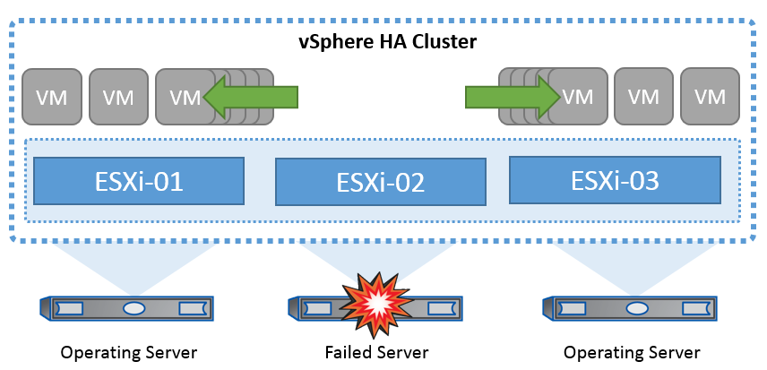
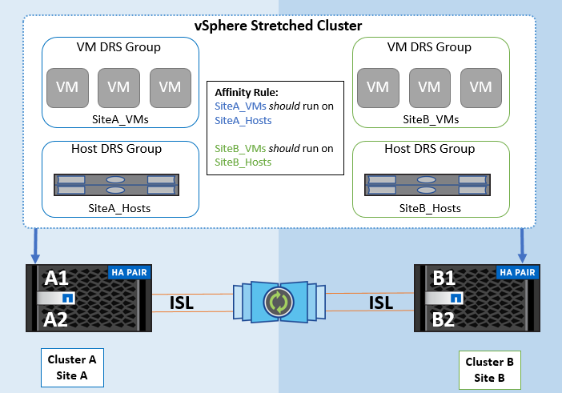

= VMware vSphere Solution Overview
:hardbreaks:
:nofooter:
:icons: font
:linkattrs:
:imagesdir: ../media/

[.lead]
The vCenter Server Appliance (VCSA) is the powerful centralized management system and single pane of glass for vSphere that enables administrators to effectively operate ESXi clusters. It facilitates key functions such as VM provisioning, vMotion operation, High Availability (HA), Distributed Resource Scheduler (DRS), Tanzu Kubernetes Grid, and more. It is an essential component in VMware cloud environments and should be designed with service availability in mind.

== vSphere High Availability

VMware’s cluster technology groups ESXi servers into pools of shared resources for virtual machines and provides vSphere High Availability (HA). vSphere HA provides easy-to-use, high availability for applications running in virtual machines. When the HA feature is enabled on the cluster, each ESXi server maintains communication with other hosts so that if any ESXi host becomes unresponsive or isolated, the HA cluster can negotiate the recovery of the virtual machines that were running on that ESXi host among surviving hosts in the cluster. In the event of a guest operating system failure, vSphere HA restarts the affected virtual machine on the same physical server. vSphere HA makes it possible to reduce planned downtime, prevent unplanned downtime, and rapidly recover from outages.

vSphere HA cluster recovering VMs from failed server.

It’s important to understand that VMware vSphere has no knowledge of NetApp MetroCluster or SnapMirror active sync and sees all ESXi hosts in the vSphere cluster as eligible hosts for HA cluster operations depending on host and VM group affinity configurations.

== Host Failure Detection

As soon as the HA cluster is created, all hosts in the cluster participate in election, and one of the hosts becomes a master. Each slave performs network heartbeat to the master, and the master in turn performs network heartbeat on all slave hosts. The master host of a vSphere HA cluster is responsible for detecting the failure of slave hosts.

Depending on the type of failure detected, the virtual machines running on the hosts might need to be failed over.

In a vSphere HA cluster, three types of host failure are detected:

* Failure - A host stops functioning.
* Isolation - A host becomes network isolated.
* Partition - A host loses network connectivity with the master host.

The master host monitors the slave hosts in the cluster. This communication is done through the exchange of network heartbeats every second. When the master host stops receiving these heartbeats from a slave host, it checks for host liveness before declaring the host to have failed. The liveness check that the master host performs is to determine whether the slave host is exchanging heartbeats with one of the datastores. Also, the master host checks whether the host responds to ICMP pings sent to its management IP addresses to detect whether it is merely isolated from its master node or completely isolated from the network. It does this by pinging the default gateway. One or more isolation addresses can be specified manually to enhance the reliability of isolation validation.

=== _Best Practice_
NetApp recommends specifying a minimum of two additional isolation addresses, and that each of these addresses be site-local. This will enhance the reliability of isolation validation.

== Host Isolation Response

Isolation Response is a setting in vSphere HA that determines the action triggered on Virtual Machines when a host in a vSphere HA cluster loses its management network connections but continues to run. There are three options for this setting, “Disabled”, “Shut Down and Restart VMs,” and “Power Off and Restart VMs.”

“Shut Down” is better than “Power Off”, which does not flush most recent changes to disk or commit transactions. If virtual machines have not shut down in 300 seconds they are powered off. To change the wait time, use the advanced option das.isolationshutdowntimeout.

Before HA initiates the isolation response, it first checks to see if the vSphere HA master agent owns the datastore that contains the VM config files. If not, then the host will not trigger the isolation response, because there is no master to restart the VMs. The host will periodically check the datastore state to determine if it is claimed by a vSphere HA agent that holds the master role.

=== _Best Practice_
NetApp recommends setting the “Host Isolation Response” to Disabled.

A split-brain condition can occur if a host becomes isolated or partitioned from the vSphere HA master host and the master is unable to communicate via heartbeat datastores or by ping. The master declares the isolated host dead and restarts the VMs on other hosts in the cluster. A split-brain condition now exists because there are two instances of the virtual machine running, only one of which can read or write the virtual disks. Split-brain conditions can now be avoided by configuring VM Component Protection (VMCP).

== VM Component Protection (VMCP)

One of the feature enhancements in vSphere 6, relevant to HA, is VMCP. VMCP provides enhanced protection from All Paths Down (APD) and Permanent Device Loss (PDL) conditions for block (FC, iSCSI, FCoE) and file storage (NFS).

=== Permanent Device Loss (PDL)

PDL is a condition that occurs when a storage device permanently fails or is administratively removed and is not expected to return. The NetApp storage array issues a SCSI Sense code to ESXi declaring that the device is permanently lost. In the Failure Conditions and VM Response section of vSphere HA, you can configure what the response should be after a PDL condition is detected.

==== _Best Practice_
NetApp recommends setting the “Response for Datastore with PDL” to “*Power off and restart VMs*”. When this condition is detected a VM will be restarted instantly on a healthy host within the vSphere HA cluster.

=== All Paths Down (APD)

APD is a condition that occurs when a storage device becomes inaccessible to the host and no paths to the array are available. ESXi considers this a temporary problem with the device and is expecting it to become available again.

When an APD condition is detected, a timer is started. After 140 seconds, the APD condition is officially declared, and the device is marked as APD time out. When the 140 seconds have passed, HA will start counting the number of minutes specified in the Delay for VM Failover APD. When the specified time has passed, HA will restart the impacted virtual machines. You can configure VMCP to respond differently if desired (Disabled, Issue Events, or Power Off and Restart VMs).

==== _Best Practice_
NetApp recommends configuring the “Response for Datastore with APD” to “*Power off and restart VMs (conservative)*”.

Conservative refers to the likelihood of HA being able to restart VMs. When set to Conservative, HA will only restart the VM that is impacted by the APD if it knows another host can restart it. In the case of Aggressive, HA will try to restart the VM even if it doesn’t know the state of the other hosts. This can result in VMs not being restarted if there is no host with access to the datastore it is located on.

If the APD status is resolved and access to the storage is restored before the time-out has passed, HA will not unnecessarily restart the virtual machine unless you explicitly configure it to do so. If a response is desired even when the environment has recovered from the APD condition, then Response for APD Recovery After APD Timeout should be configured to Reset VMs.

==== _Best Practice_
NetApp recommends configuring Response for APD Recovery After APD Timeout to Disabled.

== VMware DRS Implementation for NetApp MetroCluster

VMware DRS is a feature that aggregates the host resources in a cluster and is primarily used to load balance within a cluster in a virtual infrastructure. VMware DRS primarily calculates the CPU and memory resources to perform load balancing in a cluster. Because vSphere is unaware of stretched clustering, it considers all hosts in both sites when load balancing. To avoid cross-site traffic, NetApp recommends configuring DRS affinity rules to manage a logical separation of VMs. This will ensure that unless there is a complete site failure, HA and DRS will only use local hosts.

If you create a DRS affinity rule for your cluster, you can specify how vSphere applies that rule during a virtual machine failover.

There are two types of rules you can specify vSphere HA failover behavior:

* VM anti-affinity rules force specified virtual machines to remain apart during failover actions.
* VM host affinity rules place specified virtual machines on a particular host or a member of a defined group of hosts during failover actions.

Using VM host affinity rules in VMware DRS, one can have a logical separation between site A and site B so that the VM runs on the host at the same site as the array that is configured as the primary read/write controller for a given datastore. Also, VM host affinity rules enable virtual machines to stay local to the storage, which in turn ascertains the virtual machine connection in case of network failures between the sites.

The following is an example of VM host groups and affinity rules.

=== _Best Practice_
NetApp recommends implementing “should” rules instead of “must” rules because they are violated by vSphere HA in the case of a failure. Using “must” rules could potentially lead to service outages.

Availability of services should always prevail over performance. In the scenario where a full data center fails, “must” rules must choose hosts from the VM host affinity group, and when the data center is unavailable, the virtual machines will not restart.

== VMware Storage DRS Implementation with NetApp MetroCluster

The VMware Storage DRS feature enables the aggregation of datastores into a single unit and balances virtual machine disks when storage I/O control thresholds are exceeded.

Storage I/O control is enabled by default on Storage DRS–enabled DRS clusters. Storage I/O control allows an administrator to control the amount of storage I/O that is allocated to virtual machines during periods of I/O congestion, which enables more important virtual machines to have preference over less important virtual machines for I/O resource allocation.

Storage DRS uses Storage vMotion to migrate the virtual machines to different datastores within a datastore cluster. In a NetApp MetroCluster environment, a virtual machine migration needs to be controlled within the datastores of that site. For example, virtual machine A, running on a host at site A, should ideally migrate within the datastores of the SVM at site A. If it fails to do so, the virtual machine will continue to operate but with degraded performance, since the virtual disk read/write will be from site B through inter-site links.

=== _Best Practice_
NetApp recommends creating datastore clusters with respect to storage site affinity; that is, datastores with site affinity for site A should not be mixed with datastore clusters with datastores with site affinity for site B.

Whenever a virtual machine is newly provisioned or migrated using Storage vMotion, NetApp recommends that all the VMware DRS rules specific to those virtual machines be manually updated, accordingly. This will ascertain the virtual machine affinity at the site level for both host and datastore and thus reduce the network and storage overhead.
